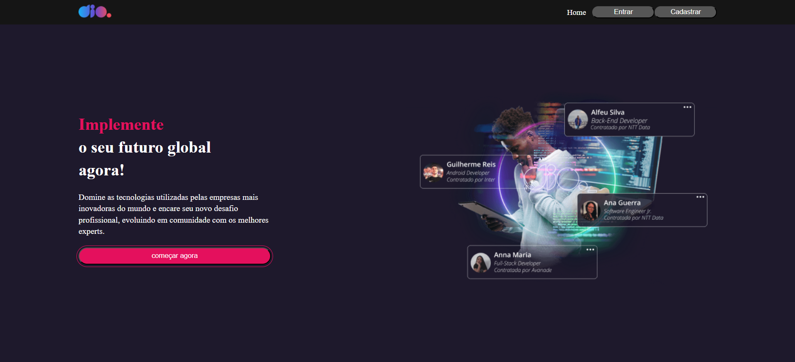
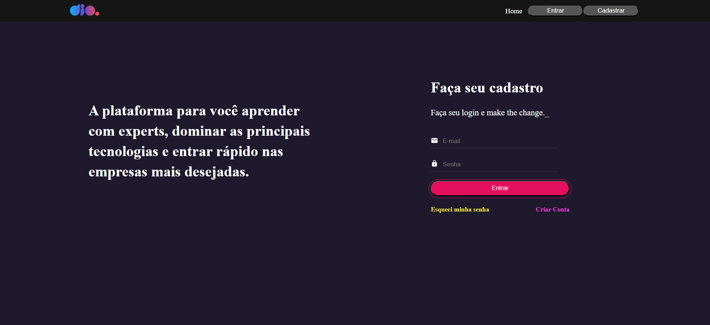
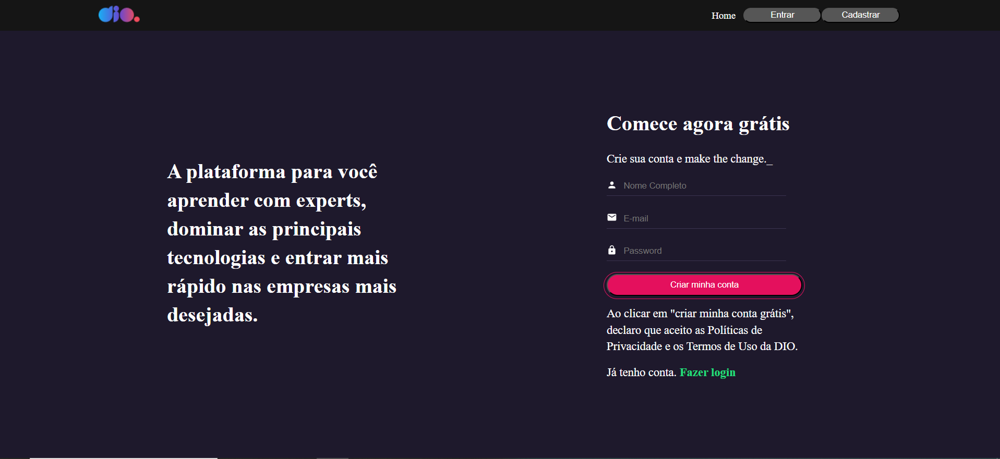
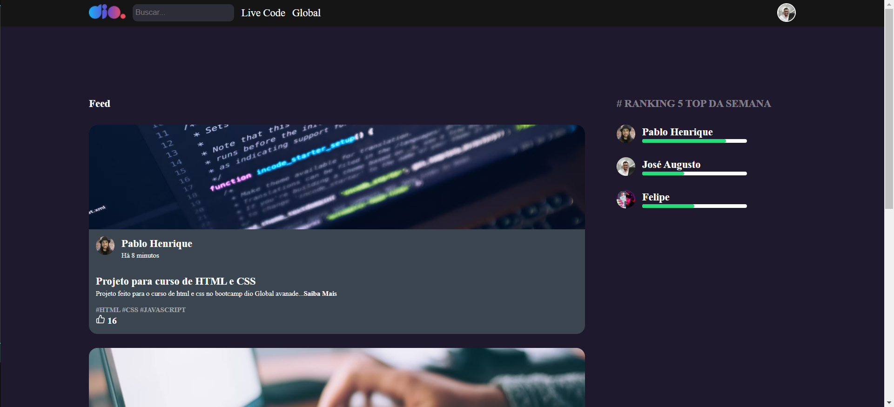
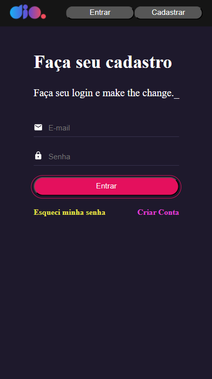
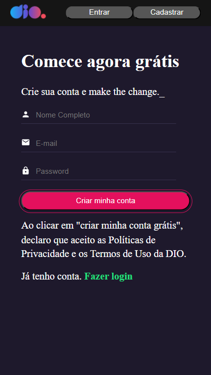
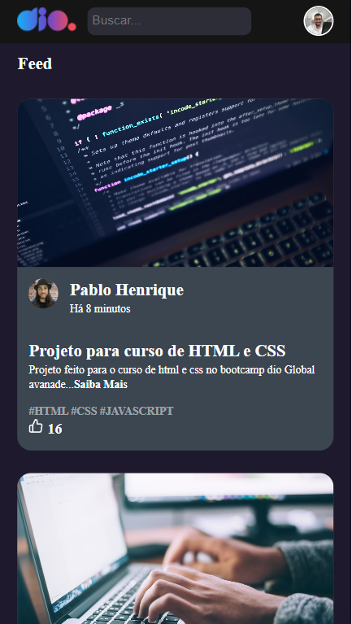

# Clone da plataforma da Dio

Este é um projeto da formação React Developer da DIO, ele consiste em criar um clone da plataforma da Dio com as telas de `Home` que é a página inicial do projeto, `Login` que é a página para o usuário fazer o login na plataforma, `Cadastro` que é a página para o usuário cadastrar  o nome, email e senha para o acesso da plataforma e a tela de `Feed` que é a página onde é mostrado os posts dos usuários e o ranking. Este projeto é totalmente responsivo podendo ser acessado tanto do computador como da smartphone. Para este projeto foi ultilizado a biblioteca `json-server` que cria uma fake API local para a validação do login na página de Login.

## Bibliotecas Utilizadas no projeto:

Para este projeto foi ultilizado as seguintes bibliotecas:

### `react-router-dom`

Esta biblioteca foi ultilizada criar as rotas de acesso os págins do projeto.

### `styled-components`

Esta biblioteca foi utilizada para fazer as estilização dos componentes das páginas.

### `react-icons`

Esta biblioteca foi utilizada para adicionar alguns icones as páginas.

### `react-hook-form`

Esta biblioteca foi utizada para manipular as informação do formulário.

### `@hookform/resolvers` e `yup`

Estas bibliotecas foram responsáveis pela validação dos campos dos formulários.

### `axios`

Biblioteca responsável por fazer requisições a uma API.

## Scripts disponíveis:

No diretório do projeto, você pode executar:

### `npm install`

Instala todos as dependências do projeto.

### `npm start`

Executa o aplicativo no modo de desenvolvimento. Abra [http://localhost:3000](http://localhost:3000) para visualizá-lo no seu navegador. A página será recarregada quando você fizer alterações. É possível ver erros de lint no console.

### `npm run build`

Cria o aplicativo para produção na pasta `build`. Ele agrupa corretamente o React no modo de produção e otimiza a compilação para o melhor desempenho. A compilação é minificada e os nomes dos arquivos incluem os hashes. Seu aplicativo está pronto para ser implantado!

### `npm api`

Inicia o servidor da api para a a validação do login.

## Design do projeto no Desktop:

Tela Home

Tela Login

Tela Cadastro

Tela Feed

## Design do projeto no Mobile:

Tela Home

Tela Login

Tela Cadastro

Tela Feed
